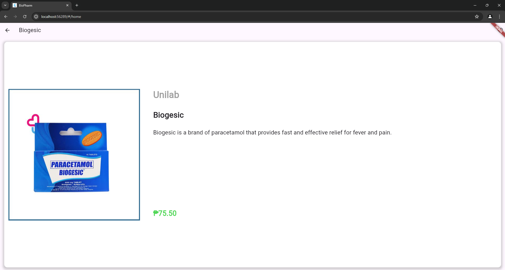

# BioPharm Flutter Chrome Application

## Overview

BioPharm is a responsive Flutter Chrome application designed to provide users with an intuitive interface for searching pharmaceutical products. The application features a login screen, a loading screen, a product search screen, detailed product views, and a favorites list.

## What the Project Does

BioPharm allows users to:

- **Login** to their accounts.
- **Search for pharmaceutical products** and view relevant details.
- **View detailed information** about each product, including its picture, brand name, medicine name, short description, and price.
- **Add products to a favorites list** by clicking the heart button, making it easy to find favorite items later.
- **Experience a responsive design** that adjusts seamlessly to different screen sizes.

## Why the Project is Useful

BioPharm provides a user-friendly platform for browsing and managing pharmaceutical products. Its responsive design ensures a consistent experience across various devices, making it convenient for users to access product information on the go.

## How Users Can Get Started with the Project

### Installation

To run this project locally, follow these steps:

1. **Clone the repository**:
    ```sh
    git clone https://github.com/AngelaDaphnie/biopharm.git
    cd biopharm
    ```

2. **Install dependencies**:
    ```sh
    flutter pub get
    ```

3. **Run the application**:
    ```sh
    flutter run -d chrome
    ```

### Usage

- **Login**: Enter one of the following usernames and passwords, then click "Login":
  - `user1` (password1)
  - `user2` (password2)
  - `user3` (password3)
  - `user4` (password4)
  - `user5` (password5)
  
- **Search for Products**: Use the search bar to find specific pharmaceutical products.
- **View Products**: Browse through the grid of products and click on any product for more details.
- **Add to Favorites**: Click the heart button on a product to add it to your favorites list.

## Maintainers and Contributors

BioPharm is maintained by:

- **Angela Daphnie Toribio** ([AngelaDaphnie](https://github.com/AngelaDaphnie))

## Demo

[Watch the Demo Video](demo_video.mp4)

## Screenshots


*Login screen where users can enter their credentials.*


*Loading screen displayed while the application is logging in.*


*Product search screen displaying a variety of pharmaceutical products.*


*Product Details Screen shows information about the selected medicine, such as image, brand name, medicine name, description/uses, and price.*


*List of medicines that users add to their favorites list.*

## Learn More About Flutter

- [Flutter Installation Guide](https://docs.flutter.dev/get-started/install)
- [Flutter Documentation](https://docs.flutter.dev/)
