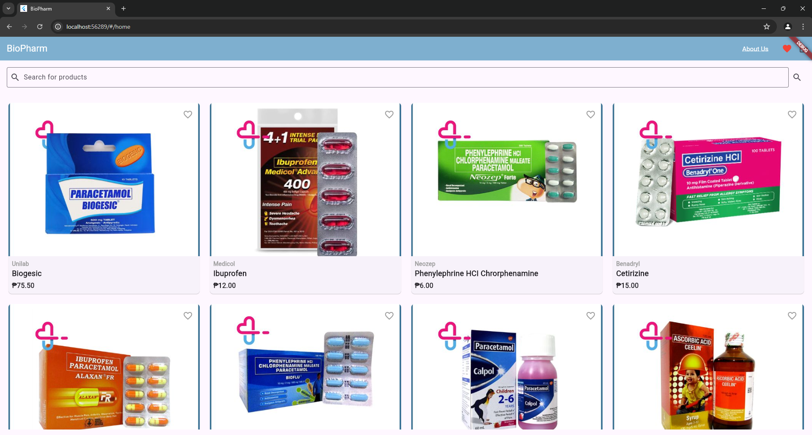

# BioPharm Flutter Chrome Application

## Overview

BioPharm is a responsive Flutter Chrome application designed to provide users with an intuitive interface to search for pharmaceutical products. The application features a login screen, a loading screen, a product search screen, product detail views, and a favorites list.

## What the Project Does

BioPharm allows users to:

- **Login** securely to their accounts.
- **Search for pharmaceutical products** and view relevant details.
- **View detailed information** about each product, including the product's picture, brand name, medicine name, short description, and price.
- **Add products to a favorites list** by clicking the heart button, making it easy to find favorite items later.
- **Experience a responsive design** that adjusts seamlessly to different screen sizes.

## Why the Project is Useful

BioPharm provides a user-friendly platform for browsing and managing pharmaceutical products. Its responsive design ensures a consistent experience across various devices, making it convenient for users to access product information on-the-go.

## How Users Can Get Started with the Project

### Installation

To run this project locally, follow these steps:

1. **Clone the repository**:
    ```sh
    git clone https://github.com/yourusername/biopharm-flutter-chrome-app.git
    cd biopharm-flutter-chrome-app
    ```

2. **Install dependencies**:
    ```sh
    flutter pub get
    ```

3. **Run the application**:
    ```sh
    flutter run -d chrome
    ```

### Usage

- **Login**: Enter your username and password, then click "Login".
- **Search for Products**: Use the search bar to find specific pharmaceutical products.
- **View Products**: Browse through the grid of products, and click on any product for more details.
- **Add to Favorites**: Click the heart button on a product to add it to your favorites list.

## Where Users Can Get Help with the Project

If you need help with BioPharm, you can:

- Check the [Issues](https://github.com/yourusername/biopharm-flutter-chrome-app/issues) section on GitHub for common problems and solutions.
- Open a new issue if you encounter a bug or need further assistance.

## Who Maintains and Contributes to the Project

BioPharm is maintained by:

- **Your Name** ([@yourusername](https://github.com/yourusername))

Contributions are welcome! To contribute to this project, please follow these steps:

1. **Fork the repository**.
2. **Create a new branch**:
    ```sh
    git checkout -b feature/your-feature-name
    ```
3. **Make your changes**.
4. **Commit your changes**:
    ```sh
    git commit -m 'Add some feature'
    ```
5. **Push to the branch**:
    ```sh
    git push origin feature/your-feature-name
    ```
6. **Open a pull request**.

## Demo

[Watch the Demo Video](videos/demo_video.mp4)

## Screenshots


*Login screen where users can enter their credentials.*


*Loading screen displayed while the application is logging in.*


*Product search screen displaying a variety of pharmaceutical products.*

## License

This project is licensed under the MIT License. See the [LICENSE](LICENSE) file for details.

## Acknowledgments

- Special thanks to the Flutter community for their excellent documentation and support.
